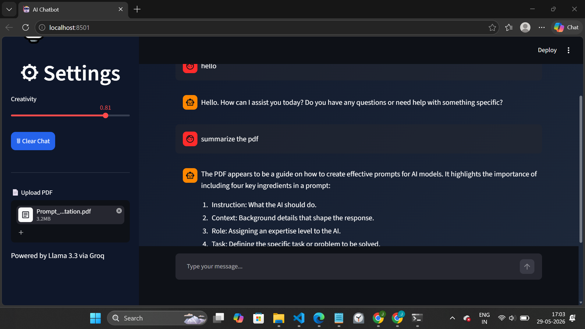

# 🤖 AI Document Assistant (RAG Chatbot)

An AI-powered document assistant built using Streamlit, Groq Llama 3.3, FAISS, and Sentence Transformers.

The chatbot allows users to upload PDF documents, ask questions about the document, and receive context-aware answers using Retrieval-Augmented Generation (RAG).

---

## 🚀 Features

- Interactive Streamlit Chat UI
- Groq Llama 3.3 Integration
- PDF Upload Support
- PDF Text Extraction
- Smart Text Chunking
- Embedding Generation using Sentence Transformers
- FAISS Vector Database
- Top-K Semantic Retrieval
- Retrieval-Augmented Generation (RAG)
- Chat History
- Clear Chat Functionality
- Display Retrieved Context Chunks

---

## 🏗️ Project Structure

```text
chatbot1/
│
├── app.py
├── requirements.txt
├── README.md
├── .gitignore
│
├── data/
│   └── sample.pdf
│
├── screenshots/
│   └── demo.png
│
└── utils/
    ├── loader.py
    ├── embedder.py
    └── retriever.py
```

---

## ⚙️ Technologies Used

- Python
- Streamlit
- Groq API
- Llama 3.3 70B Versatile
- PyPDF
- LangChain Text Splitters
- Sentence Transformers
- FAISS
- NumPy

---

## 🔄 How the RAG Pipeline Works

### Step 1: Upload PDF

The user uploads a PDF document through the Streamlit interface.

### Step 2: Extract Text

Text is extracted from the PDF using PyPDF.

### Step 3: Chunking

The extracted text is split into smaller chunks using LangChain's RecursiveCharacterTextSplitter.

Configuration:

```python
chunk_size = 500
chunk_overlap = 50
```

This overlap helps preserve context between neighboring chunks.

### Step 4: Create Embeddings

Each chunk is converted into vector embeddings using:

```text
all-MiniLM-L6-v2
```

from Sentence Transformers.

### Step 5: Store in FAISS

The embeddings are stored in a FAISS vector index for efficient similarity search.

### Step 6: Retrieve Relevant Chunks

When a user asks a question:

- The query is embedded
- Similar chunks are retrieved from FAISS
- Top-K chunks are selected

### Step 7: Generate Response

The retrieved chunks are provided as context to Groq's Llama 3.3 model, which generates the final answer.

---

## 📄 What Document Did You Use and Why?

I used a PDF document containing Prompt Engineering concepts and techniques.

This document was selected because it contains structured educational content that can effectively demonstrate semantic retrieval and document question-answering capabilities.

---

## 🧠 Which Embedding Model Did You Use?

Sentence Transformers:

```text
all-MiniLM-L6-v2
```

This model generates compact semantic embeddings that work well for similarity search and retrieval tasks.

---

## 📸 Screenshot

### Application Demo



---

## ▶️ Installation

### Clone Repository

```bash
git clone https://github.com/jaswanth07m/chatbot1.git
cd chatbot1
```

### Install Dependencies

```bash
pip install -r requirements.txt
```

### Configure Environment Variables

Create a `.env` file:

```env
GROQ_API_KEY=your_groq_api_key
```

### Run Application

```bash
streamlit run app.py
```

---

## 💬 Example Questions

After uploading a PDF, users can ask:

- Summarize this document
- What is the main topic?
- Explain the key concepts
- List important points
- What does the document say about X?

---

## 🔮 Future Improvements

If given more time, I would add:

- Multi-PDF Support
- Website URL Ingestion
- Persistent Vector Database
- Semantic Re-ranking
- Hybrid Search
- Voice Input
- Conversation Memory Across Sessions
- Deployment on Streamlit Cloud

---

## 👨‍💻 Author

Jaswanth

Built as part of an AI/LLM Internship Assignment.
